# 🛵 GigShield — AI-Powered Parametric Income Insurance for Food Delivery Partners

> **DEVTrails 2026 | Phase 1 Submission**
> Protecting the livelihoods of Zomato & Swiggy delivery partners against uncontrollable income disruptions.
> *Updated March 19, 2026 — Adversarial Defense patch in response to Market Crash scenario.*

---

## Table of Contents

1. [Problem & Persona](#1-problem--persona)
2. [Our Solution](#2-our-solution)
3. [Persona-Based Scenarios & Workflow](#3-persona-based-scenarios--workflow)
4. [Weekly Premium Model & Parametric Triggers](#4-weekly-premium-model--parametric-triggers)
5. [Platform Decision](#5-platform-decision)
6. [AI/ML Integration Plan](#6-aiml-integration-plan)
7. [**Adversarial Defense & Anti-Spoofing Strategy**](#7-adversarial-defense--anti-spoofing-strategy)
8. [Tech Stack & Architecture](#8-tech-stack--architecture)
9. [Development Plan](#9-development-plan)
10. [Team](#10-team)

---

## 1. Problem & Persona

**Persona: Food Delivery Partner** — Zomato / Swiggy riders in Tier-1 Indian cities (Chennai, Mumbai, Bengaluru, Hyderabad).

These riders earn ₹600–₹1,200/day, work 8–12 hours/day, and have **zero income protection** when external disruptions stop their deliveries. When a cyclone hits or the city floods, Zomato pauses orders. The rider loses the day. Their rent doesn't pause.

**GigShield insures their income — not their bike, not their health — just the income lost when external events stop deliveries.**

---

## 2. Our Solution

GigShield is an AI-powered parametric insurance platform that:

- **Profiles** each rider's risk using zone-level historical data + ML
- **Prices** weekly premiums dynamically using XGBoost (~₹35–₹80/week)
- **Triggers** claims automatically when external thresholds are breached
- **Detects fraud** using a multi-layer adversarial defense system (see Section 7)
- **Pays out** directly to UPI within minutes — zero rider action required

> Coverage scope: Income loss ONLY due to external disruptions. No health, life, accident, or vehicle repair coverage.

---

## 3. Persona-Based Scenarios & Workflow

### Scenario A — Cyclone / Heavy Rain (Chennai)
1. IMD issues Red Alert. Rainfall crosses 64mm in T. Nagar zone.
2. GigShield's Node.js trigger service detects breach via OpenWeatherMap API.
3. Platform API confirms Zomato has paused orders in the zone.
4. FastAPI backend queries all 312 active policies in that zone.
5. For each rider — adversarial defense layer runs (Section 7).
6. Clean riders: claim auto-approved → ₹400 to UPI in ~10 minutes.
7. Flagged riders: placed in grace queue with 2-hour window to self-verify.

### Scenario B — Severe AQI (Delhi NCR)
1. CPCB AQI crosses 400 (Severe) for 3+ consecutive hours.
2. Trigger fires for all active policies in affected zones.
3. Multi-signal fraud check runs — AQI-specific behavioral patterns validated.
4. Payout processed for verified riders.

### Scenario C — Coordinated Fraud Ring (Market Crash scenario)
1. 500 riders in a Telegram group activate GPS-spoofing apps simultaneously.
2. All 500 spoof their location to T. Nagar during a Red Alert event.
3. GigShield's adversarial defense detects: sudden mass GPS convergence, device fingerprint clustering, accelerometer stillness, and cell tower mismatch.
4. All 500 claims auto-routed to SYNDICATE_REVIEW — zero payouts drain the pool.
5. Insurer dashboard fires real-time fraud ring alert with cluster visualization.

### End-to-End Application Workflow



---

## 4. Weekly Premium Model & Parametric Triggers

### Why Weekly?
Gig workers receive platform payouts weekly. A weekly insurance premium aligns cost with income flow — riders pay from what they just earned.

### Premium Calculation

```
Weekly Premium = Base Rate × Risk Multiplier × Coverage Multiplier

Base Rate         = ₹50
Risk Multiplier   = f(zone_flood_history, avg_weekly_AQI, disruption_frequency_90d)
Coverage Mult.    = f(avg_daily_hours, avg_daily_earnings_declared)
```

| Rider Profile | Weekly Premium | Max Weekly Payout |
|---|---|---|
| Low-risk zone, 6hrs/day | ₹35 | ₹500 |
| Medium-risk zone, 8hrs/day | ₹55 | ₹800 |
| High-risk zone, 10hrs/day | ₹80 | ₹1,200 |

### Parametric Triggers

| Trigger | Threshold | Data Source |
|---|---|---|
| Heavy Rain | Rainfall > 64mm/hr | IMD / OpenWeatherMap |
| Flood Alert | IMD Red Alert issued | IMD RSS |
| Severe AQI | AQI > 400 for 3+ hrs | CPCB API |
| Platform Suspension | Zone status = PAUSED | Platform API (mocked) |
| Curfew / Section 144 | Official zone closure | Govt Alert API (mocked) |

All triggers require **dual confirmation** — weather threshold AND platform suspension. This alone eliminates false claims from weather events that don't actually affect deliveries.

---

## 5. Platform Decision

**Decision: Progressive Web App (PWA) — Web-first, mobile-responsive**

| Factor | Choice | Reason |
|---|---|---|
| Rider interface | Mobile PWA | No app install — shareable via WhatsApp link |
| Insurer dashboard | Desktop web | Analytics-heavy, wider screen preferred |
| Offline support | PWA Service Worker | Riders in low-connectivity zones |
| Distribution | URL via WhatsApp | How gig workers already communicate |

---

## 6. AI/ML Integration Plan

### 6.1 Dynamic Premium — XGBoost Regressor
Input features: zone flood score, avg AQI, disruption frequency (90d), daily hours, declared earnings. Output: weekly premium in ₹. Trained on synthetic IMD historical data with rule-based fallback.

### 6.2 Fraud Detection — Multi-Layer Engine
Standard rule-based layer (GPS zone, duplicates, frequency) + Isolation Forest anomaly scoring + adversarial defense (full detail in Section 7).

### 6.3 Predictive Insurer Dashboard — Prophet
Time-series forecasting of next week's expected claims based on weather forecasts. Outputs: expected claim volume, estimated payout, high-risk zones.

---

## 7. Adversarial Defense & Anti-Spoofing Strategy

> *This section was added in direct response to the DEVTrails Market Crash scenario (March 19, 2026): a 500-member fraud syndicate coordinating via Telegram, using GPS-spoofing apps to fake locations during a Red Alert weather event and drain the liquidity pool.*
>
> *Simple GPS coordinate checking is officially obsolete. GigShield's response is a 6-signal adversarial defense architecture.*

---

### The Core Principle

A real stranded delivery partner leaves a **rich, consistent, multi-dimensional digital footprint**. A fraudster running a GPS spoofing app at home does not. Our system detects the difference across six independent signal dimensions — no single signal can block a legitimate claim, but multiple weak signals create an unbeatable combined score.

---

### 7.1 The Differentiation — Real Rider vs Bad Actor

#### Signal 1 — Behavioral History / Mobility Fingerprint

Every rider builds a **30-day mobility fingerprint**: the routes they actually travel, the zones they work in, their average speed between GPS pings, and their daily coverage radius. This fingerprint is stored as a probability distribution over Chennai's zones.

A genuine T. Nagar rider has 80%+ of their historical pings in or near T. Nagar. A fraudster from Perambur who has never pinged in T. Nagar suddenly "appears" there the moment a Red Alert is issued. Their mobility fingerprint produces a near-zero similarity score for that location.

**Detection method:** Cosine similarity between claimed location and 30-day mobility fingerprint. Score < 0.3 → MOBILITY_MISMATCH flag.

**Why this beats GPS spoofing:** A spoofing app changes your GPS coordinates. It cannot retroactively change 30 days of real movement history.

---

#### Signal 2 — Device Sensor Fusion (Accelerometer + Gyroscope)

A rider physically stranded in a flood zone is anxious, moving, sheltering — their phone is in motion. Vibration from rain, movement while seeking shelter, and the general physical activity of being outside in an emergency all register on the accelerometer.

A fraudster sitting at home with a spoofing app running is **stationary**. Their accelerometer shows near-zero variance for the entire trigger window.

We collect periodic sensor snapshots via the PWA (explicitly consented at onboarding as part of the "active protection" feature). Accelerometer variance below a threshold during the 30 minutes before and after a trigger event is flagged.

**Detection method:** Accelerometer standard deviation during trigger window < 0.15 m/s² for 20+ consecutive minutes → STILLNESS_FLAG.

**Why this beats GPS spoofing:** A GPS spoofer changes their reported location. It does not shake their phone.

---

#### Signal 3 — Cell Tower Region vs GPS Mismatch

GPS coordinates can be spoofed with a $5 app. Cell tower connections **cannot be faked without specialized hardware** that no Telegram syndicate will have.

When a rider's phone connects to the mobile network, it associates with physical cell towers. Those towers have known locations. A rider in T. Nagar connects to towers in T. Nagar. A rider at home in Perambur connects to towers in Perambur — regardless of what their GPS coordinates claim.

We capture the network carrier's approximate cell region (accessible via standard browser/mobile network APIs) and cross-reference against the claimed GPS zone.

**Detection method:** Cell tower region ≠ claimed GPS zone → CARRIER_MISMATCH flag. This is our single strongest anti-spoofing signal.

**Why this beats GPS spoofing:** GPS and cell towers are completely independent systems. Spoofing one does not spoof the other.

---

#### Signal 4 — Platform Activity Correlation

If a rider is genuinely unable to work due to a disruption, their Zomato/Swiggy app activity should reflect that: they went offline, declined orders, or show zero activity in the trigger window.

A bad actor at home may still have their platform app open and active — potentially even accepting orders — while simultaneously claiming income loss from a disruption in another zone.

We cross-reference platform activity data (mocked in Phase 1, real API integration in Phase 2): was this rider accepting, declining, or ignoring orders in the 2 hours before and during the trigger?

**Detection method:** Rider shows platform activity (order pings received + responded to) during claimed disruption window → ACTIVITY_ANOMALY flag.

---

#### Signal 5 — Coordinated Timing Cluster Detection (Syndicate Signal)

This is our most powerful defense against the **Telegram syndicate scenario** specifically. Individual spoofing is hard to detect. But 500 people doing it simultaneously creates a statistically impossible pattern.

In genuine disruptions, riders' GPS pings "arrive" in the affected zone organically over 30–90 minutes as the event unfolds — some riders were already there, some moved there before the alert, some sheltered nearby. The distribution of arrival timestamps is broad and natural.

A coordinated syndicate acts on a Telegram signal. They all activate their spoofing apps within minutes of each other, right after the Red Alert is issued. This produces a sharp spike: hundreds of GPS coordinates all converging on the same zone within a **2–5 minute window**.

We run a **DBSCAN temporal clustering algorithm** on GPS arrival timestamps during every trigger event. Natural arrival distributions have a standard deviation of 20–40 minutes. A coordinated attack has a standard deviation of 2–3 minutes.

**Detection method:** DBSCAN identifies a temporal cluster of 20+ GPS arrivals in the same zone within a 5-minute window → SYNDICATE_ALERT fired. All claims in the cluster auto-routed to SYNDICATE_REVIEW queue. Zero payouts until human review completes.

**Why this beats Telegram coordination:** The syndicate's organizational efficiency — everyone acting at the same time — is exactly what makes them detectable. The more coordinated they are, the sharper the cluster, the more obvious the fraud.

---

#### Signal 6 — Cross-Rider Device Fingerprint Graph

Fraud syndicates share resources: the same spoofing app tutorial, the same device, or accounts created on the same device. This leaves a trace. Multiple rider accounts linked to the same device fingerprint, similar app installation patterns, or identical browser/device signatures.

We maintain a **device fingerprint graph** across all rider accounts (fingerprint collected at onboarding via browser APIs). During a fraud event, we check whether flagged riders are nodes in the same connected component of this graph.

**Detection method:** 3+ flagged riders from the same trigger event sharing a device fingerprint cluster → LINKED_DEVICE_RING flag added to all their claims.

---

### 7.2 The Data — Complete Signal Table

| Signal | Data Points Collected | Collection Method | Spoofing Resistance |
|---|---|---|---|
| Mobility fingerprint | 30-day GPS ping history, zone distribution | App heartbeat every 5 min | High — history cannot be retroactively faked |
| Accelerometer variance | Motion sensor readings during trigger window | PWA sensor API (consented) | High — physical stillness is real |
| Cell tower region | Network carrier cell ID / region | Browser network API | Very High — requires hardware to fake |
| Platform activity | Order accept/decline/online status | Platform API (mocked Phase 1) | High — cross-system validation |
| GPS arrival timing | Timestamp of first ping in trigger zone | Trigger event log + DBSCAN | Very High — coordination creates the signal |
| Device fingerprint | Browser fingerprint + device ID hash | Collected at onboarding | Medium — shared devices leave traces |
| Claim history | Prior claims, fraud flags, clean record | PostgreSQL | High — loyalty is hard to fake |
| IP address region | Approximate IP geolocation | Request metadata | Low (VPN-bypassable) — used as soft signal only |

**Important:** IP geolocation is listed as a *low-resistance* signal — VPNs bypass it trivially. We use it only as a soft signal, never as a blocking condition. Our strong signals (cell tower, DBSCAN, accelerometer) are not VPN-bypassable.

---

### 7.3 The UX Balance — Protecting Honest Riders

**This is the most critical design constraint: our fraud system must never punish a genuine rider who is already suffering from a disruption.**

The scenario we must protect against: a real rider in T. Nagar during a flood, whose GPS drops due to network congestion (extremely common in heavy rain), who has no cell signal, and whose phone is low on battery and not moving much because they're sheltering. This rider triggers 2–3 of our signals. They are exactly who GigShield was built for.

Our response: **a tiered grace system that treats every flagged claim as "innocent until proven guilty."**

#### Tier 1 — Auto-Approve (Green)
Fraud score < 0.25. All major signals clean. Payout within 10 minutes. No rider interaction needed.

#### Tier 2 — Grace Queue (Amber)
Fraud score 0.25–0.50. 1–2 weak signals flagged (e.g. GPS gap from network drop, slightly anomalous mobility score).

The rider is **never told they are suspected of fraud.** They receive: *"Your claim is being processed. We'll confirm your payout shortly."*

The system waits up to **2 hours** for signals to recover. When the rider's GPS re-locks (it will, once weather allows), the carrier match and mobility score are re-evaluated. If they resolve → auto-approved, payout released. If not → escalated to Tier 3.

This 2-hour window covers the vast majority of genuine network-drop cases, because real riders' signals recover naturally as conditions improve.

#### Tier 3 — Manual Review (Orange)
Fraud score 0.50–0.75. 2–3 signals flagged including at least one strong signal.

Rider receives: *"We need one more check before your payout — usually takes 2–4 hours."*

A human reviewer on the insurer dashboard examines the case. The rider is **not asked for documents or photos** — too burdensome during an active disruption. The reviewer can approve, deny, or request a simple in-app location confirmation tap.

#### Tier 4 — Syndicate Block (Red)
Fraud score > 0.75 OR SYNDICATE_ALERT triggered (DBSCAN cluster + device graph). All claims in the cluster are blocked. Insurer dashboard shows the cluster timeline, device graph, and geographic heatmap. Legal/fraud team notified. No individual rider notification until investigation completes — notifying them tips off the syndicate.

#### The Loyalty Modifier
For Tier 2 and Tier 3 cases: if a rider has a **clean claims history** (2+ previous paid claims, zero fraud flags), their fraud score is automatically reduced by 30 points. Long-term platform loyalty is a strong genuine signal that no short-term fraudster can fake.

---

### 7.4 Defense Architecture Summary


---

## 8. Tech Stack & Architecture

| Layer | Technology | Purpose |
|---|---|---|
| Frontend | Next.js PWA | Rider app + insurer dashboard |
| Core API | Python FastAPI | Auth, onboarding, policy, claims, analytics |
| Trigger service | Node.js + Express | Live API polling + trigger engine |
| ML models | XGBoost + DBSCAN + Isolation Forest | Premium + syndicate + anomaly detection |
| Database | PostgreSQL + Redis | Persistent data + real-time event queue |
| Payouts | Razorpay Sandbox | Simulated UPI payouts |
| Hosting | Vercel + Railway | Frontend + backend/triggers |

---

## 9. Development Plan

### Phase 1 (Mar 4–20) — Ideation & Foundation ✅
- [x] Persona, scenarios, and workflow defined
- [x] Parametric triggers and thresholds defined
- [x] Weekly premium model designed
- [x] Tech stack and full architecture finalized
- [x] **Adversarial defense strategy designed (Section 7)**
- [x] GitHub repo with README
- [x] 2-minute strategy video

### Phase 2 (Mar 21–Apr 4) — Automation & Protection
- [ ] OTP login + rider onboarding flow
- [ ] XGBoost premium model trained on synthetic IMD data
- [ ] 5 live parametric trigger monitors
- [ ] End-to-end claim flow with adversarial defense engine
- [ ] Razorpay sandbox payout integration
- [ ] Basic DBSCAN syndicate detector

### Phase 3 (Apr 5–17) — Scale & Optimise
- [ ] Full DBSCAN syndicate detection on live events
- [ ] Device fingerprint graph (real-time)
- [ ] Predictive insurer dashboard (Prophet forecasting)
- [ ] Full 5-minute demo with simulated fraud syndicate attack
- [ ] Final pitch deck

---

## 10. Team

| Member | Role |
|---|---|
| JEFFERY | Frontend (Next.js PWA) + UI/UX |
| RETHICK CB | Backend (FastAPI) + ML Models |
| ANUMITHA | Node.js Triggers + DevOps + Integrations |

---

## Links

- **Demo Video (Phase 1):** *[https://drive.google.com/file/d/1otSFYJbscJ2AQvKicCFPgvFkGe-ge0WJ/view?usp=sharing]*
- **Demo Video (Phase 2):** *[https://drive.google.com/file/d/1uYF4OhWYmSEnGOE84zt1C5qHyMMue51q/view?usp=sharing]*
- **Working Flow of GigShield (A-to-Z User Journey):** *[https://docs.google.com/document/d/1iY1RXoYvIFcCpAB63u5oArhq6brKYp3RFs-VskJQknA/edit?usp=sharing]*
- **GigShield Production Deployment Stack (A-to-Z System Architecture):** *[https://docs.google.com/document/d/191XSIEZxsFC9Ba6hIAjQSrxvocN8sHzs24kSHVCKqQs/edit?usp=sharing]*

> *"When the rain stops the deliveries, GigShield starts the payouts. And when the syndicates try to drain the pool — GigShield catches them first."*
