# 🛵 GigShield — AI-Powered Parametric Income Insurance for Food Delivery Partners

> **DEVTrails 2026 | Phase 1(Seed),2(Scale),3(Soar) **
> Protecting the livelihoods of Zomato & Swiggy delivery partners against uncontrollable income disruptions.
> *Updated April 14, 2026 — Full cloud deployment, persisted ML models, advanced fraud detection.*

---
## 🌐 Live Applications - (START_GUIDE.md)

| Product | URL | Description |
|---------|-----|-------------|
| 🛵 **Rider PWA (B2C)** | [gig-shield-ai-two.vercel.app](https://gig-shield-ai-two.vercel.app/) | Delivery partner app — OTP login, coverage dashboard, payout notifications |
| 🏦 **Insurer Portal (B2B)** | [gigshield-insurer-portal-3ybx.vercel.app](https://gigshield-insurer-portal-3ybx.vercel.app/) | Insurance company dashboard — live alerts, batch approval, fraud analytics |

---

## Table of Contents

1. [Problem & Persona](#1-problem--persona)
2. [Our Solution](#2-our-solution)
3. [System Architecture](#3-system-architecture)
4. [Persona-Based Scenarios & Workflow](#3-persona-based-scenarios--workflow)
5. [Weekly Premium Model & Parametric Triggers](#4-weekly-premium-model--parametric-triggers)
6. [AI/ML Integration — Persisted Models](#6-aiml-integration--persisted-models)
7. [Platform Decision](#5-platform-decision)
8. . [**Adversarial Defense & Anti-Spoofing Strategy**](#7-adversarial-defense--anti-spoofing-strategy)
9. . [Tech Stack & Architecture](#8-tech-stack--architecture)
10. [Development Plan](#9-development-plan)
11. [Team](#10-team)

---

## 1. Problem & Persona

**Persona: Food Delivery Partner** — Zomato / Swiggy riders in Tier-1 Indian cities (Chennai, Mumbai, Bengaluru, Hyderabad).

These riders earn ₹600–₹1,200/day, work 8–12 hours/day, and have **zero income protection** when external disruptions stop their deliveries. When a cyclone hits or the city floods, Zomato pauses orders. The rider loses the day. Their rent doesn't pause.

**GigShield insures their income — not their bike, not their health — just the income lost when external events stop deliveries.**

---

## 2. Our Solution

GigShield is an AI-powered parametric insurance platform that:

- **Profiles** each rider's risk using zone-level historical data + ML
- **Prices** weekly premiums dynamically using XGBoost (~₹35–₹80/week)
- **Triggers** claims automatically when external thresholds are breached
- **Detects fraud** using a multi-layer adversarial defense system (see Section 7)
- **Pays out** directly to UPI within minutes — zero rider action required

> Coverage scope: Income loss ONLY due to external disruptions. No health, life, accident, or vehicle repair coverage.

---


## 3. System Architecture


```
┌─────────────────────────────────────────────────────────────────────┐
│                        GIGSHIELD PLATFORM                           │
├──────────────┬──────────────────┬──────────────────┬───────────────-┤
│  THE WATCHMAN│   THE ENGINE     │  THE PARTNER     │  THE VAULT     │
│              │                  │                  │                │
│  Node.js     │  FastAPI         │  Rider PWA       │  Insurer       │
│  Trigger     │  Backend         │  Next.js         │  Portal        │
│  Service     │  (Port 8001)     │  (Port 3000)     │  Next.js       │
│  (Port 3001) │                  │                  │  (Port 3002)   │ 
│              │  ┌────────────┐  │                  │                │
│  • IMD poll  │  │ XGBoost    │  │  • Firebase OTP  │  • Live alerts │
│  • OWM poll  │  │ Premium    │  │  • Dashboard     │  • Batch appr  │
│  • AQI check │  │ Model .pkl │  │  • Notif centre  │  • Fraud DNA   │
│  • Threshold │  ├────────────┤  │  • Payout hist   │  • Prophet     │
│    breach    │  │ Isolation  │  │  • Offline PWA   │    forecast    │
│  • Fire event│  │ Forest.pkl │  │                  │  • Heatmap     │
│              │  └────────────┘  │                  │                │
├──────────────┴──────────────────┴──────────────────┴───────────────-┤
│                          DATA LAYER                                 │
│  PostgreSQL (Ledger)  ·  Redis (Zone Watchlists + B2B Balance)      │
├─────────────────────────────────────────────────────────────────────┤
│                        DEPLOYMENT                                   │
│  Railway (DB+Redis) → Render (Backend+Trigger) → Vercel (Frontends) │
│  Firebase Auth (OTP)  ·  Razorpay Sandbox (UPI Payouts)             │
└─────────────────────────────────────────────────────────────────────┘
```

---

## 4. Persona-Based Scenarios & Workflow

### Scenario A — Cyclone / Heavy Rain (Chennai)
1. IMD issues Red Alert. Rainfall crosses 64mm in T. Nagar zone.
2. GigShield's Node.js trigger service detects breach via OpenWeatherMap API.
3. Platform API confirms Zomato has paused orders in the zone.
4. FastAPI backend queries all active policies in that zone.
5. **Adversarial defence layer runs** — 6 signals evaluated per rider.
6. Clean riders (score < 0.25): claim auto-approved → ₹400 to UPI in ~10 minutes.
7. Amber-tier riders (0.25–0.50): placed in grace queue, 2-hour recovery window.
8. Red-tier riders (> 0.75): syndicate block, legal team notified.

### Scenario B — Coordinated Fraud Ring (Telegram Syndicate)

1. 500 riders in a Telegram group activate GPS-spoofing apps simultaneously.
2. All 500 spoof their location to T. Nagar during a Red Alert event.
3. GigShield's DBSCAN detector fires: 500 GPS coordinates converge in under 2 minutes (natural arrival: 20–40 min std deviation).
4. All 500 claims auto-routed to `SYNDICATE_REVIEW` — zero payouts.
5. Insurer dashboard shows cluster timeline, device graph, and geographic heatmap.

### End-to-End Application Workflow



---

## 5. Weekly Premium Model & Parametric Triggers

### Why Weekly?

Gig workers receive platform payouts weekly. A weekly insurance premium aligns cost with income flow.

### Premium Formula

```
Weekly Premium = Base Rate × Risk Multiplier × Coverage Multiplier

Base Rate         = ₹50
Risk Multiplier   = f(zone_flood_score, avg_weekly_aqi, disruption_freq_90d)
Coverage Mult.    = f(avg_daily_hours, avg_daily_earnings_declared)
```

| Rider Profile | Weekly Premium | Max Weekly Payout |
|---------------|----------------|-------------------|
| Low-risk zone, 6 hrs/day | ₹35 | ₹500 |
| Medium-risk zone, 8 hrs/day | ₹55 | ₹800 |
| High-risk zone, 10 hrs/day | ₹80 | ₹1,200 |

### Parametric Triggers

| Trigger | Threshold | Data Source |
|---------|-----------|-------------|
| Heavy Rain | Rainfall > 64mm/hr | IMD / OpenWeatherMap |
| Flood Alert | IMD Red Alert issued | IMD RSS |
| Severe AQI | AQI > 400 for 3+ hrs | CPCB API |
| Platform Suspension | Zone status = PAUSED | Platform API |
| Curfew / Section 144 | Official zone closure | Govt Alert API |

All triggers require **dual confirmation** — weather threshold AND platform suspension.
---

## 6. AI/ML Integration Plan

### 6.1 Dynamic Premium — XGBoost Regressor (Persisted as .pkl)

```
Input features:  zone_flood_score, avg_weekly_aqi, disruption_freq_90d,
                 avg_daily_hours, avg_daily_earnings, week_of_year, month
Output:          weekly_premium_inr (₹35–₹80)
Performance:     MAE ₹3.2  ·  R² 0.91  ·  CV MAE ₹3.5 ± 0.4
```

**Training Data Sources:**
- [Open-Meteo Historical API](https://archive-api.open-meteo.com/v1/archive) — Real Chennai rainfall 2018–2023 (free, no key)
- [CPCB AQI Repository](https://app.cpcbccr.com/ccr/#/caaqm-dashboard-all/caaqm-landing/aqi-repository) — City-level AQI archive
- [Kaggle Food Delivery Dataset](https://www.kaggle.com/datasets/gauravmalik26/food-delivery-dataset) — 45,000 delivery records, India
- [IMD Gridded Rainfall](https://www.imdpune.gov.in/Clim_Pred_LRF_New/Grided_Data_Download.html) — 0.25° daily rainfall data

### 6.2 Fraud Detection — Isolation Forest (Persisted as .pkl)

```
Input features:  mobility_match, cell_tower_ok, accelerometer_variance,
                 platform_activity, arrival_timing, device_fingerprint
Output:          fraud_score (0.0–1.0)
Contamination:   5%  ·  200 estimators
```

### 6.3 Predictive Insurer Dashboard — Prophet

Time-series forecasting of next 7 days' expected claims based on weather forecasts. Outputs: expected claim volume, confidence bands, high-risk zones.

### Model Files

```
backend/models/
  xgboost_premium_model.pkl     ← Weekly premium predictor
  isolation_forest_fraud.pkl    ← Fraud anomaly scorer
  feature_scaler.pkl            ← StandardScaler for fraud model
  fraud_feature_list.pkl        ← Feature list
  model_metadata.json           ← Version, metrics, training info
```


---

## 7. Platform Decision

**Decision: Progressive Web App (PWA) — Web-first, mobile-responsive**

| Factor | Choice | Reason |
|---|---|---|
| Rider interface | Mobile PWA | No app install — shareable via WhatsApp link |
| Insurer dashboard | Desktop web | Analytics-heavy, wider screen preferred |
| Offline support | PWA Service Worker | Riders in low-connectivity zones |
| Distribution | URL via WhatsApp | How gig workers already communicate |

---

## 8. Adversarial Defense & Anti-Spoofing Strategy
> *Designed in response to the DEVTrails Market Crash scenario: a 500-member fraud syndicate coordinating via Telegram, using GPS-spoofing apps during a Red Alert weather event.*

### The 6 Signals

| # | Signal | Detection Method | Spoofing Resistance |
|---|--------|-----------------|-------------------|
| 1 | Mobility Fingerprint | Cosine similarity < 0.3 vs 30-day history → flag | **HIGH** — history cannot be retroactively faked |
| 2 | Cell Tower Region | Cell region ≠ claimed GPS zone → CARRIER_MISMATCH | **VERY HIGH** — requires hardware to fake |
| 3 | Accelerometer Variance | Stillness for 20+ min during trigger → STILLNESS_FLAG | **HIGH** — physical stillness is real |
| 4 | Platform Activity | Order activity during claimed disruption → anomaly | **HIGH** — cross-system validation |
| 5 | DBSCAN Temporal Cluster | 20+ GPS arrivals in same zone within 5 min → SYNDICATE_ALERT | **VERY HIGH** — coordination creates the signal |
| 6 | Device Fingerprint Graph | 3+ flagged riders sharing device fingerprint → LINKED_DEVICE_RING | **MEDIUM** — shared devices leave traces |

### Fraud Tier Routing

| Tier | Score Range | Action | Description |
|------|-------------|--------|-------------|
| 🟢 Tier 1 | < 0.25 | **AUTO-APPROVE** | UPI payout in 10 minutes |
| 🟡 Tier 2 | 0.25–0.50 | **GRACE QUEUE** | 2-hour recovery window, rider not notified |
| 🟠 Tier 3 | 0.50–0.75 | **MANUAL REVIEW** | Human reviewer, 2–4 hour resolution |
| 🔴 Tier 4 | > 0.75 | **SYNDICATE BLOCK** | Legal team notified, zero payouts |

**Loyalty Modifier:** Clean claims history (2+ paid, zero flags) → fraud score reduced by 30 points.

---

## 9. Tech Stack & Architecture

| Layer | Technology | Purpose |
|-------|-----------|---------|
| Frontend (Rider) | Next.js 14 PWA | Rider app — OTP login, dashboard, notifications |
| Frontend (Insurer) | Next.js 14 | B2B insurer dashboard — live alerts, batch approval |
| Core API | Python FastAPI | Auth, onboarding, policy, claims, ML inference |
| Trigger Service | Node.js + Express | Live API polling + parametric trigger engine |
| ML Models | XGBoost + Isolation Forest | Premium prediction + fraud scoring |
| Forecasting | Prophet | 7-day insurer claim forecast |
| Database | PostgreSQL | Persistent ledger — riders, policies, claims, events |
| Cache / Queue | Redis | B2B balance (atomic), zone watchlists, GPS trails |
| Auth | Firebase | OTP phone login + Google sign-in |
| Payouts | Razorpay Sandbox | Simulated UPI disbursement |
| Hosting | Vercel + Render + Railway | Frontends + API + Database |


---

## 10. Cloud Deployment Guide

### Infrastructure Map

```
Railway.app              Render.com               Vercel.com
──────────────           ──────────────────       ──────────────────────
PostgreSQL          →    FastAPI Backend      →   Rider App (B2C)
Redis               →    Node.js Triggers     →   Insurer Portal (B2B)
```

### Environment Variables

| Variable | Service | Description |
|----------|---------|-------------|
| `DATABASE_URL` | Render Backend + Trigger | Railway PostgreSQL public URL |
| `REDIS_URL` | Render Backend | Railway Redis public URL |
| `NEXT_PUBLIC_API_URL` | Vercel (both frontends) | `https://your-backend.onrender.com` |
| `FRONTEND_URL` | Render Backend | Vercel Rider App URL (CORS) |
| `INSURER_URL` | Render Backend | Vercel Insurer Portal URL (CORS) |
| `BACKEND_URL` | Render Trigger | Render Backend URL |

### Quick Deploy Steps

1. **Railway** → New Project → Add PostgreSQL → Add Redis → copy `DATABASE_PUBLIC_URL` and `REDIS_PUBLIC_URL`
2. **Render** → New Web Service → `cbrethick/GigShield-AI`, Root: `gigshield/backend` → add env vars
3. **Render** → New Web Service → `cbrethick/GigShield-AI`, Root: `gigshield/trigger-service` → add `BACKEND_URL`
4. **Vercel** → Import `cbrethick/GigShield-AI`, Root: `gigshield/frontend` → add `NEXT_PUBLIC_API_URL`
5. **Vercel** → Import `cbrethick/gigshield-insurer-portal`, Root: `.` → add `NEXT_PUBLIC_API_URL`
6. Update `FRONTEND_URL` and `INSURER_URL` in Render Backend with the Vercel URLs from steps 4–5.

### Demo Reset

```bash
POST /api/v1/insurer/reset
```
Clears all history, resets Redis B2B balance to ₹1,00,000. Use before every demo run.

---

## 11. Development Plan

### Phase 1 (Mar 4–20) — Ideation & Foundation ✅

- Persona, scenarios, and workflow defined
- Parametric triggers and thresholds designed
- Weekly premium model and actuarial formula
- Tech stack and full architecture finalised
- Adversarial defence strategy designed
- GitHub repo + strategy video

### Phase 2 (Mar 21–Apr 4) — Automation & Protection ✅

- OTP login + rider onboarding flow (Firebase)
- XGBoost premium model trained on synthetic IMD data
- 5 live parametric trigger monitors
- End-to-end claim flow with adversarial defence engine
- Razorpay sandbox payout integration
- Basic DBSCAN syndicate detector

### Phase 3 (Apr 5–17) — Scale & Optimise ✅

- Full DBSCAN syndicate detection on live events
- Device fingerprint graph (real-time)
- **Persisted ML models** (.pkl) — XGBoost + Isolation Forest (fixes Phase 2 review gap)
- Predictive insurer dashboard (Prophet 7-day forecasting)
- **Full cloud deployment** (Railway + Render + Vercel)
- Universal demo reset endpoint
- 5-minute demo video + Phase 3 pitch deck

---

## 12. Team

| Member | Role |
|---|---|
| JEFFERY | Frontend (Next.js PWA) + UI/UX |
| RETHICK CB | Backend (FastAPI) + ML Models |
| ANUMITHA | Node.js Triggers + DevOps + Integrations |

---

## Links

| Resource | Link |
|----------|------|
| 🛵 Rider App (Live) | https://gig-shield-ai-two.vercel.app/ |
| 🏦 Insurer Portal (Live) | https://gigshield-insurer-portal-3ybx.vercel.app/ |
| 📦 GitHub — Rider App | https://github.com/cbrethick/GigShield-AI |
| 📦 GitHub — Insurer Portal | https://github.com/cbrethick/gigshield-insurer-portal |
| 🎬 Demo Video (Phase 1) | https://drive.google.com/file/d/1otSFYJbscJ2AQvKicCFPgvFkGe-ge0WJ/view?usp=sharing |
| 🎬 Demo Video (Phase 2) | https://drive.google.com/file/d/1uYF4OhWYmSEnGOE84zt1C5qHyMMue51q/view?usp=sharing |
| 🎬 Demo Video (Phase 3) | https://drive.google.com/file/d/1uYF4OhWYmSEnGOE84zt1C5qHyMMue51q/view?usp=sharing |
| 📄 Working Flow (A–Z User Journey) | https://docs.google.com/document/d/1iY1RXoYvIFcCpAB63u5oArhq6brKYp3RFs-VskJQknA/edit?usp=sharing |
| 📄 Production Architecture (A–Z) | https://docs.google.com/document/d/191XSIEZxsFC9Ba6hIAjQSrxvocN8sHzs24kSHVCKqQs/edit?usp=sharing |

> *"When the rain stops the deliveries, GigShield starts the payouts. And when the syndicates try to drain the pool — GigShield catches them first."*
