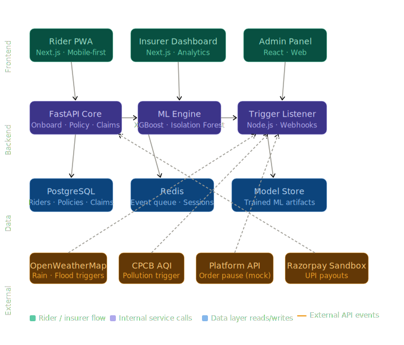

# 🛵 GigShield — AI-Powered Parametric Income Insurance for Food Delivery Partners

> **DEVTrails 2026 | Team Submission | Phase 1**
> Protecting the livelihoods of Zomato & Swiggy delivery partners against uncontrollable income disruptions.

---

## 📌 Table of Contents

1. [Problem & Persona](#1-problem--persona)
2. [Our Solution](#2-our-solution)
3. [Persona-Based Scenarios & Workflow](#3-persona-based-scenarios--workflow)
4. [Weekly Premium Model & Parametric Triggers](#4-weekly-premium-model--parametric-triggers)
5. [Platform Decision: Web vs Mobile](#5-platform-decision-web-vs-mobile)
6. [AI/ML Integration Plan](#6-aiml-integration-plan)
7. [Tech Stack & Architecture](#7-tech-stack--architecture)
8. [Development Plan](#8-development-plan)
9. [Team](#9-team)

---

## 1. Problem & Persona

### Who We're Protecting
**Persona: Food Delivery Partner** — Zomato / Swiggy riders operating in Tier-1 Indian cities (Chennai, Mumbai, Bengaluru, Hyderabad).

These riders:
- Earn ₹600–₹1,200/day depending on orders and hours
- Work 8–12 hours/day, 6 days/week
- Have **zero income protection** when disruptions stop deliveries
- Operate on a **weekly payout cycle** from their platform

### The Gap
When a cyclone, flash flood, or severe AQI event hits, Zomato/Swiggy suspends deliveries. The rider loses 100% of that day's income — no fallback, no safety net, no savings buffer.

**GigShield fills this gap with automated, parametric income insurance.**

---

## 2. Our Solution

**GigShield** is an AI-powered parametric insurance platform that:

- 🔍 **Profiles** each rider's risk based on their zone, working hours, and historical disruption data
- 💰 **Prices** weekly premiums dynamically using ML models (~₹35–₹80/week)
- ⚡ **Triggers** automatic claims when external disruption thresholds are breached
- 🏦 **Pays out** directly to the rider's UPI/bank within hours — no claim filing needed
- 🛡️ **Detects fraud** using GPS validation, anomaly detection, and cross-platform data

> **Coverage scope:** Income loss ONLY due to external disruptions. No health, life, accident, or vehicle repair coverage.

---

## 3. Persona-Based Scenarios & Workflow

### Scenario A — Cyclone / Heavy Rain (Chennai)
1. IMD issues Red Alert for Chennai — rainfall > 80mm predicted
2. GigShield's weather monitoring API detects threshold breach
3. All active GigShield policies in Chennai automatically flagged
4. Rider receives SMS: _"Rain alert triggered. If Zomato suspends orders in your zone, your income for today is covered."_
5. Platform API (mocked) confirms order suspension in rider's zone
6. Claim auto-initiated → payout of ₹400 (4hrs × ₹100 avg/hr) processed to UPI
7. Rider notified: _"₹400 credited to your UPI. Stay safe."_

### Scenario B — Severe Pollution / AQI Alert (Delhi NCR)
1. CPCB AQI monitor crosses 400+ (Severe) for rider's zone
2. Parametric trigger fires automatically
3. Rider's active weekly policy covers up to 3 hours of lost income
4. Auto-claim processed; no rider action needed

### Scenario C — Local Curfew / Section 144
1. News/Government API (mocked) flags sudden zone closure
2. GigShield cross-checks rider's last GPS ping vs restricted zone
3. If rider was in the zone at curfew time → income loss trigger activated
4. Payout processed within 2 hours

### End-to-End Application Workflow

```
[Rider Onboarding]
     ↓
[Zone & Hours Profiling via GPS + Platform Data]
     ↓
[AI Risk Score Generated]
     ↓
[Weekly Policy Issued with Dynamic Premium]
     ↓
[Real-Time Disruption Monitoring — Weather / AQI / Traffic / Platform APIs]
     ↓
[Parametric Trigger Fires Automatically]
     ↓
[Fraud Check — GPS Validation + Anomaly Detection]
     ↓
[Auto Claim Approved & Payout Processed (UPI/Bank)]
     ↓
[Rider Dashboard Updated | Insurer Analytics Refreshed]
```

---

## 4. Weekly Premium Model & Parametric Triggers

### Why Weekly?
Gig workers receive platform payouts weekly. A monthly insurance premium creates affordability friction. A weekly model aligns insurance cost with income flow — riders pay from what they just earned.

### Premium Calculation Formula

```
Weekly Premium = Base Rate × Risk Multiplier × Coverage Multiplier

Base Rate       = ₹50 (flat baseline)
Risk Multiplier = f(zone_flood_history, avg_weekly_AQI, disruption_frequency_last_90d)
Coverage Multiplier = f(avg_daily_hours, avg_daily_earnings_declared)
```

**Sample Weekly Premiums:**
| Rider Profile | Weekly Premium | Max Weekly Payout |
|---|---|---|
| Low-risk zone, 6hrs/day | ₹35 | ₹500 |
| Medium-risk zone, 8hrs/day | ₹55 | ₹800 |
| High-risk zone, 10hrs/day | ₹80 | ₹1,200 |

### Parametric Triggers (Defined Thresholds)

| Trigger | Threshold | Data Source |
|---|---|---|
| Heavy Rain | Rainfall > 64mm/6hrs in rider's pincode | IMD API / OpenWeatherMap |
| Flood Alert | IMD Red Alert for rider's district | IMD RSS / Mock |
| Severe AQI | AQI > 400 (Severe) for 3+ hours | CPCB API / Mock |
| Platform Suspension | Zomato/Swiggy app shows "orders paused" in zone | Platform API (Mocked) |
| Curfew / Section 144 | Official government notification in zone | Government Alert API (Mocked) |

> All triggers are **objective, verifiable, and independent of the rider's actions** — the hallmark of parametric insurance.

---

## 5. Platform Decision: Web vs Mobile

**Decision: Progressive Web App (PWA) — Web-first, Mobile-responsive**

### Rationale
| Factor | Our Choice | Reason |
|---|---|---|
| Rider Interface | Mobile-optimized PWA | Riders are mobile-first; no app install friction |
| Admin / Insurer Dashboard | Desktop Web | Analytics-heavy; wider screen preferred |
| Offline Support | PWA Service Worker | Riders in low-connectivity zones |
| Distribution | URL sharing via WhatsApp | Zomato/Swiggy onboarding groups use WhatsApp |

A native mobile app would require Play Store approval delays. A PWA gives mobile UX instantly via a WhatsApp link — which is exactly how gig workers communicate.

---

## 6. AI/ML Integration Plan

### 6.1 Dynamic Premium Calculation (ML)

**Model:** Gradient Boosting Regressor (XGBoost)

**Input Features:**
- Rider's operating zone (pincode cluster)
- Historical disruption frequency in that zone (last 90 days)
- Average AQI readings for the zone
- Flood/waterlogging risk score (from public GIS data)
- Rider's average working hours per day
- Rider's declared average daily earnings

**Output:** Weekly premium in ₹

**Training Data:** Synthetic dataset generated from IMD historical weather data + mock disruption logs (Phase 1); real API data integrated in Phase 2.

### 6.2 Fraud Detection (Anomaly Detection)

**Model:** Isolation Forest + Rule-Based Layer

**Fraud Signals We Detect:**
| Signal | Detection Method |
|---|---|
| GPS spoofing (fake location) | Compare GPS trace consistency with network cell tower data |
| Claiming during non-working hours | Cross-check claim time vs rider's declared schedule |
| Duplicate claims for same event | Event deduplication by trigger ID + rider ID |
| Sudden zone change before claim | Geofence validation — rider must be in affected zone |
| Cluster fraud (multiple riders, same IP) | Device fingerprinting + IP clustering |

### 6.3 Predictive Risk Dashboard (Insurer Side)

**Model:** Time-Series Forecasting (Prophet / LSTM)

**Predicts:**
- Expected claims for next week based on weather forecasts
- Loss ratio trend per zone
- High-risk zones for upcoming week

---

## 7. Tech Stack & Architecture

### Frontend
- **React.js + Next.js** — PWA, SSR for fast load on mobile
- **TailwindCSS** — Mobile-first UI
- **Recharts / Chart.js** — Analytics dashboard

### Backend
- **Python + FastAPI** — Core API server (risk scoring, premium calc, claim processing)
- **Node.js + Express** — Webhook listener for real-time trigger events from external APIs

### AI/ML
- **scikit-learn / XGBoost** — Premium calculation model
- **Isolation Forest (scikit-learn)** — Fraud detection
- **Prophet** — Predictive analytics for insurer dashboard

### Database
- **PostgreSQL** — Riders, policies, claims, transactions
- **Redis** — Real-time trigger event queue

### Integrations
- **OpenWeatherMap API** (free tier) — Weather triggers
- **CPCB AQI API** (public) — Pollution triggers
- **Razorpay Sandbox** — Simulated UPI payouts
- **Mock APIs** — Platform suspension, curfew alerts (custom mock server in Node.js)

### Infrastructure
- **Docker + Docker Compose** — Local dev & deployment
- **Vercel** — Frontend hosting
- **Railway / Render** — Backend hosting

### Architecture Diagram



## 8. Development Plan

### Phase 1 (Mar 15–20): Ideation & Foundation ✅
- [x] Define persona, scenarios, and workflow
- [x] Define parametric triggers and thresholds
- [x] Design weekly premium model
- [x] Finalize tech stack and architecture
- [ ] Set up GitHub repo with project scaffold
- [ ] Record 2-minute strategy video

### Phase 2 (Mar 21–Apr 4): Automation & Protection
- [ ] Rider onboarding flow (registration, zone, hours)
- [ ] ML premium calculation model (trained on synthetic data)
- [ ] Policy creation and management
- [ ] Build 5 parametric trigger monitors (weather, AQI, platform mock, curfew mock, flood)
- [ ] Claims management — auto-trigger → auto-approve flow
- [ ] Basic fraud detection (rule-based layer)
- [ ] Razorpay sandbox payout integration

### Phase 3 (Apr 5–17): Scale & Optimise
- [ ] Advanced ML fraud detection (Isolation Forest)
- [ ] Predictive insurer dashboard (Prophet forecasting)
- [ ] Worker dashboard — earnings protected, active coverage
- [ ] Full end-to-end demo with simulated disruption
- [ ] Final pitch deck

---

## 9. Team

| Member | Role |
|---|---|
| JEFFERY | Frontend (React/Next.js) + UI/UX |
| RETHICK CB | Backend (FastAPI) + ML Models |
| ANUMITHA | Node.js Triggers + DevOps + Integrations |

---

## 🔗 Links

- **Demo Video (Phase 1):** _[Link to be added]_
---

> _"When the rain stops the deliveries, GigShield starts the payouts."_
